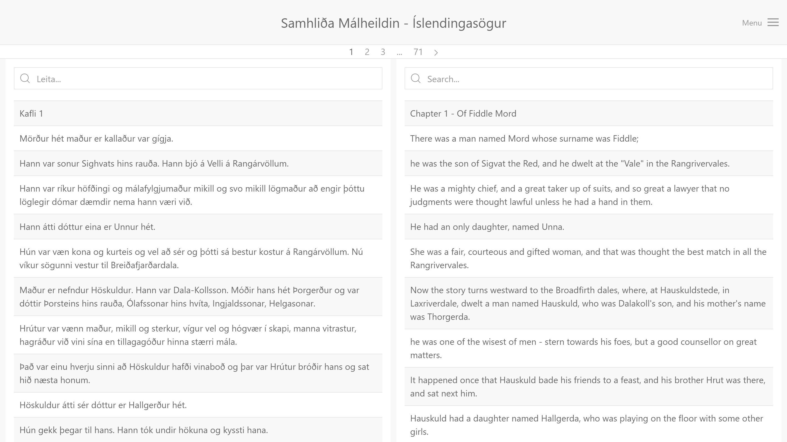

<p align="center"><i>
  Project 1<br/>
  MLT201F Language resources for software development and research, 2019-1 <br/>
  University of Iceland - School of Humanitie , Sæmundargata 2, IS-101 Reykjavik, Iceland
</i></p>


<p align="center">
Search Tool for the Icelandic Parallel Corpus <br/>
http://icealign.herokuapp.com/
</p>


## Table of Contents
<!-- ⛔️ MD-MAGIC-EXAMPLE:START (TOC:collapse=true&collapseText=Click to expand) -->
<details>
<summary>Click to expand</summary>

1. [Introduction](#1-introduction)
    * [Preprocess](#21-Preprocess)
2. [The Dataset](#2-the-dataset)
3. [Setup](#3-setup)
4. [Authors](#4-authors)
5. [License](#5-license)
6. [References](#6-references)

</details>
<!-- ⛔️ MD-MAGIC-EXAMPLE:END -->

## 1 Introduction
IceAlign is a barebones Django app, which can easily be deployed to Heroku.

This web application serves as a corpus search tool for the  Icelandic Parallel Corpus(IPC).

It improves upon the already existing corpus tool available at [http://malheildir.arnastofnun.is/](http://malheildir.arnastofnun.is/#?stats_reduce=word&isCaseInsensitive&searchBy=word&cqp=%5B%5D)



<p align="center">
IceAlign - Corpus Search Tool  Screenshot
</p>

## 2 The Dataset
The data for the IPC is can be obtained here: [ParIce-1.0](http://malfong.is/index.php?dlid=91)

More details about the content of the corpus is available at [malfong.is](http://malfong.is/?pg=samhlida).

The preprocessed data entries for version ParIce-1.0 can be found in the [parice_dataset](parice_dataset) directory.

### 2.1 Preprocess
Skip this section if you want to use the the dataset that is already provided.
Follow these steps if you want to generate your own .txt files (the same as under [parice_dataset](parice_dataset) ) from the .tmx files in the IPC ParIce-1.0.zip.

#### Step 1
Unzip the content of your received IPC dataset from [malfong.is](http://malfong.is/?pg=samhlida)
```bash
$ unzip ParIce-1.0.zip -d ParIce-1.0
```

Make sure the ParIce-1.0 directory is in the root of this project.

#### Step 2
Move our tmx2txt.sh script to the ParIce-1.0 directory.

```bash
~/icealign
$ mv scripts/tmx2txt ParIce-1.0/
```

#### Step 3
Make the script executable and run it.

```bash
~/icealign
$ cd ParIce-1.0/

~/icealign/ParIce-1.0
$ chmod 777 tmx2txt.sh

~/icealign/ParIce-1.0
$ bash tmx2txt.sh
```

The script extracts all the line entries for each .tmx file, and then splits up the larger files into smaller files with 50000 line entries each. This is done so that Heroku Free or Hobby server does not run out of memory and crash during the population of the Heroku database.   

#### Step 4
Rename the txt directory and move it to the root of this project.

```bash
~/icealign/ParIce-1.0
$ mv text parice_dataset

~/icealign/ParIce-1.0
$ mv parice_dataset ../
```

## 3 Setup
Make sure you have Python 3.7 [installed locally](http://install.python-guide.org). To push to Heroku, you'll need to install the [Heroku CLI](https://devcenter.heroku.com/articles/heroku-cli), as well as [Postgres](https://devcenter.heroku.com/articles/heroku-postgresql#local-setup).

```bash
~/icealign/
$ python -m venv getting-started
$ pip install -r requirements.txt

$ createdb icealign

$ python manage.py migrate
$ python manage.py collectstatic

$ heroku local
```

The IceAlign app should now be running on [localhost:5000](http://localhost:5000/).

To populate our Postgres database with the line entries within the [parice_dataset](parice_dataset) directory run:
```bash
~/icealign/
$ mv scripts/populate_samhlida.py ./
$ python populate_samhlida.py
Populating Samhlida database!
```
This might take some time to run.

## 4 Authors
* [Egill Anton Hlöðversson](https://github.com/egillanton) - MSc. Language Technology Student

## 5 License
This project is licensed under the MIT License - see the [LICENSE](LICENSE) file for details.

## 6 References

<p align="center">
🌟 PLEASE STAR THIS REPO IF YOU FOUND SOMETHING INTERESTING 🌟
</p>
